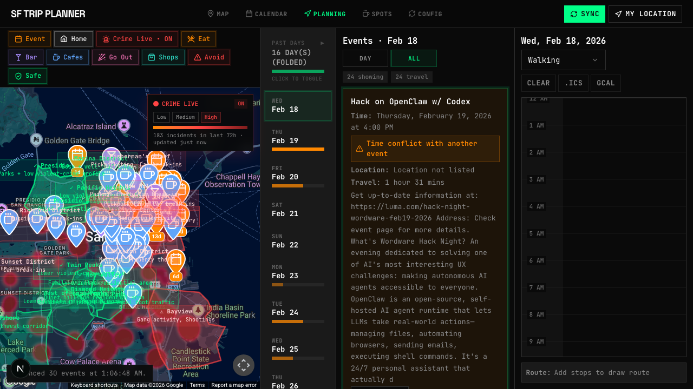
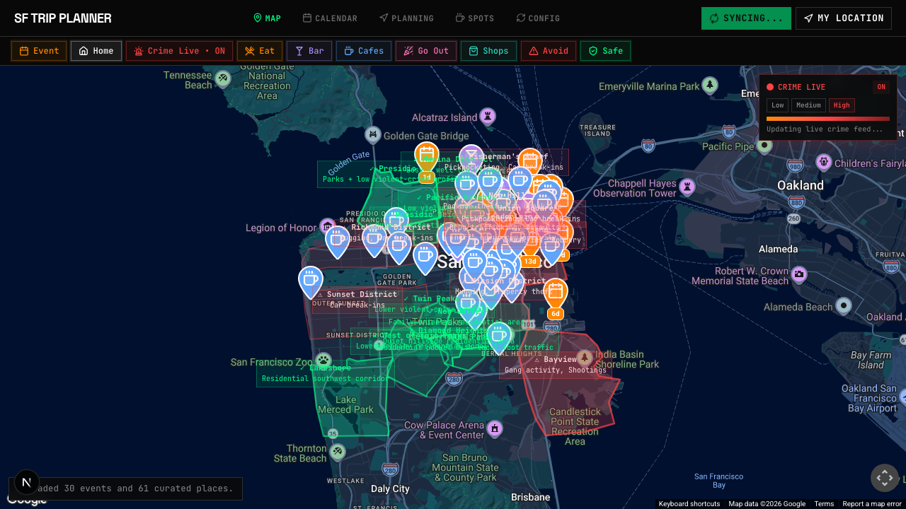
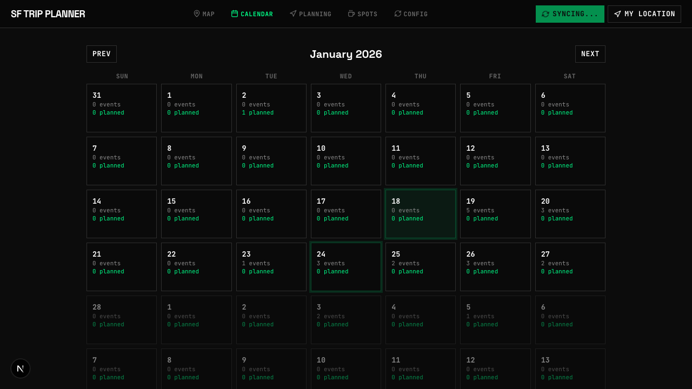

# SF Trip Planner

**Turn 50 open tabs into one trip plan.**

See where every event is. See when they conflict. See where it's safe to walk. One screen that shows you everything you need to decide — then plan your days, plan with friends, and export to Google Calendar.



## What It Does

### See Everything

- **Events on a map** — Syncs from Luma calendars and Beehiiv RSS newsletters via Firecrawl. Every event plotted with color-coded pins.
- **Curated spots** — Import cafes, restaurants, bars, and shops from any source. Tagged by category, visible on the same map alongside events.
- **Crime heatmap** — Toggle a live crime heatmap overlay sourced from SFPD and CivicHub data. See which blocks had recent incidents before picking a dinner spot.
- **Calendar overview** — Each day shows how many events are available and how many you've planned. Spot packed days and empty ones at a glance.



### Plan It

- **Drag-and-drop day planner** — Drag events and spots into a time-grid planner. Rearrange by dragging. Routes update automatically on the map.
- **Plan with friends** — Create a shared planner room. Both schedules side by side, but you only edit your own.
- **Export** — Export your itinerary as an ICS file or sync directly to Google Calendar.




## Tech Stack

Next.js 15 · React 19 · TypeScript · Convex · Google Maps API · Tailwind CSS v4 · Firecrawl · Vercel

## Setup

1. Clone and install:

```bash
git clone https://github.com/madeyexz/SF_trip.git
cd SF_trip
bun install
```

2. Copy env template and fill in your keys:

```bash
cp .env.example .env
```

Key environment variables:

| Variable | Required | Purpose |
|----------|----------|---------|
| `FIRECRAWL_API_KEY` | Yes | RSS newsletter extraction (Beehiiv → events) |
| `GOOGLE_MAPS_BROWSER_KEY` | Yes | Map rendering in browser |
| `CONVEX_URL` / `NEXT_PUBLIC_CONVEX_URL` | Yes | Convex persistence and auth |
| `AUTH_RESEND_KEY` | Yes | Magic-link email auth via Resend |
| `AUTH_EMAIL_FROM` | Production | Verified sender for auth emails |
| `GOOGLE_MAPS_ROUTES_KEY` | Optional | Day-plan route drawing |
| `GOOGLE_MAPS_GEOCODING_KEY` | Optional | Server-side pre-geocoding during sync |
| `GOOGLE_MAPS_MAP_ID` | Optional | Advanced Markers styling |

3. Set up Convex:

```bash
bun convex:dev     # initialize / dev-connect
bun convex:deploy  # deploy schema and functions
```

4. Run:

```bash
bun dev
```

Open `http://localhost:3000`.

## Scripts

| Command | What it does |
|---------|-------------|
| `bun dev` | Start dev server |
| `bun build` | Production build |
| `bun start` | Run production build |
| `bun lint` | Run ESLint |
| `bun lint:fix` | Auto-fix lint issues |
| `bun format` | Format with Prettier |
| `bun convex:dev` | Connect to Convex dev |
| `bun convex:deploy` | Deploy Convex functions |

## Deploy

Fork the repo, add your environment variables, and deploy to Vercel:

[](https://vercel.com/new/clone?repository-url=https://github.com/madeyexz/SF_trip)

## License

[GPL-3.0](LICENSE)
